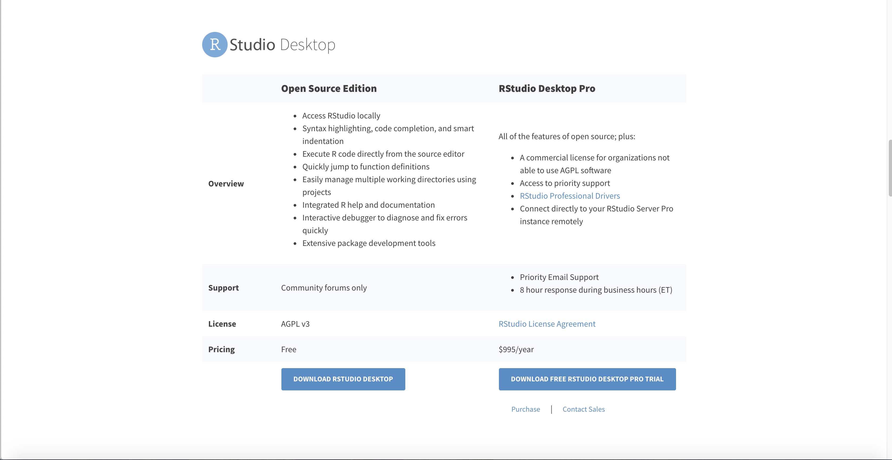
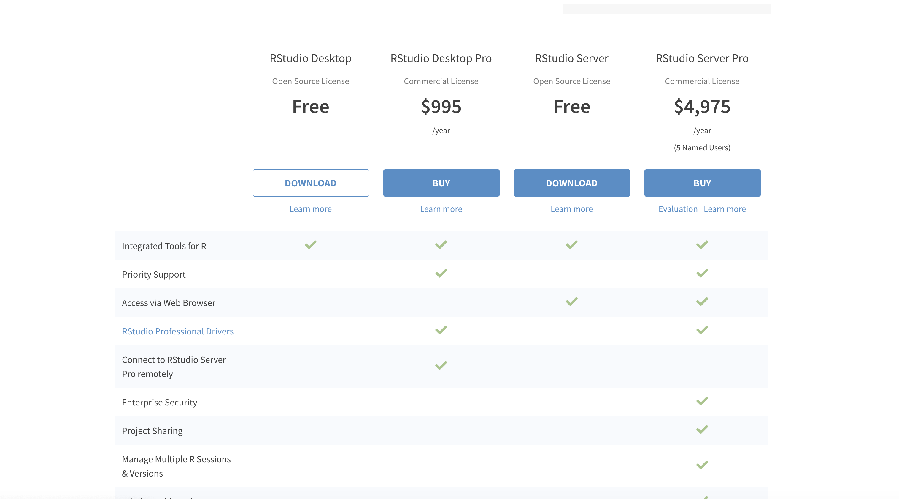
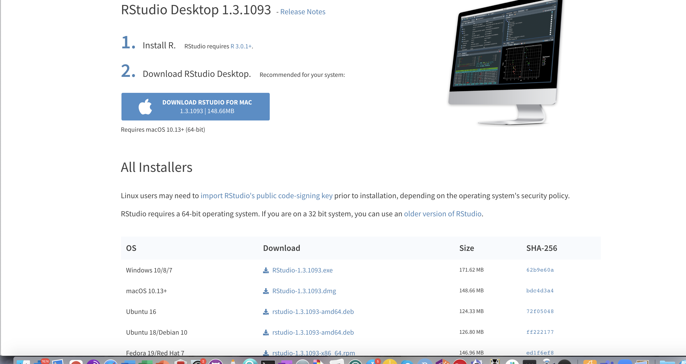

# Getting Set Up For The Course

There are three bits of software necessary to install.

1. R
2. RStudio
3. GitHub Desktop

I have also included a screencast of how to go through and install these here. 

## Installing R
There are Mac and PC versions of the statistical software R. Please visit this website [https://cran.r-project.org/](https://cran.r-project.org/) and select either Mac OS or PC. Download the software to anywhere on your PC, double-click and walk-through the steps necessary. 

## Installing RStudio
You can consider R to be the engine of a car; it actually does the work of the data analysis. But you can consider RStudio to be the dashboard; a bunch of user friendly panels to tell you what is happening and tools to make the engine do the work. You'll actually never open up R on its own; you'll only ever work with RStudio. But RStudio won't work without R.

To install RStudio visit: [https://rstudio.com/products/rstudio/](https://rstudio.com/products/rstudio/) and download the free version of RStudio Desktop. Follow the steps below:

 

 

When you reach this screen, select the version of RStudio that matches your operating system. 

 

## Installing GitHub Desktop

# Installing Course Packages

R works with **packages** of commands that have been developed by other people to accomplish certain tasks. JUst like any software you use on your computer, these have to be installed. Then, when you want to use them, you load them in R using the command `library("package_name")`. 

It's not that different from regular software. First you have to install it, then you have to open it. 

To the best of my knowledge, all of the packages necessary for the course have already been installed on the OD211 computers. However, it will be necessary to install these on any computer you wish to use, including your personal computers.

It can take a few minutes to install all these packages, so I'd like you to take a stab at doing that over the weekend, so we can be prepared for class on Monday. Here is how you do it. 

If you look inside the course folder that we cloned to your computer from your repository, you should see a file `install_script.R` and `install_script_with_plots.R`. Here is a screenshot from my own course folder; yours shoud look very similar to this.  

Open either of these files. The only difference between the two is that the file `install_script_with_plots.R` will make two basic graphs that tell you that everything is working well. 

Open them by double-clicking the file DMJN328.Rproj.  This should open RStudio. If it doesn't, open RStudio, select File > Open Project and naviage to your folder and open `DMJN328.Rproj`

Then select File > Open File. It should open a dialogue box of files in the course folder. Double-click on `install_script_with_plots.R` . You should see a new file open up in RStudio. This is an R script and this is the type of file that we will be working with through the course.

The only thing you need to do here is execute the entire R Script. The easiest way to do this at this point is to hit `Source` in the top middle of the screen. Note: you have to be connected to the internet for this to work. Also, you *may* get some messages asking you to install different versions of the software. Honestly, it won't make a huge difference, but if you do, just select "Y" for Yes or, if the option presents itself choose to install the CRAN version of the package. This might require you entering in a number (e.g. 1 or 2) in the R console and pressing enter. But it's pretty easy. 

Warning: There was one small typo in the R script. The very last line might read `ggsve('test_plot_2.png')`. It **should** read `ggsave('test_plot_2.png')`. You don't need to change it, it won't effect anything. This command is just trying to save one of your test plots to your computer. If you want to you can change it to `ggsave` and save the R script, then run it. Again, this is totally not necessary at this point. 

Please let me know if you encounter any difficulties!

